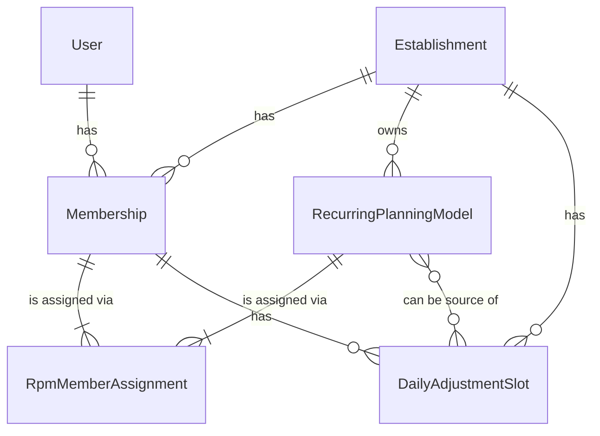
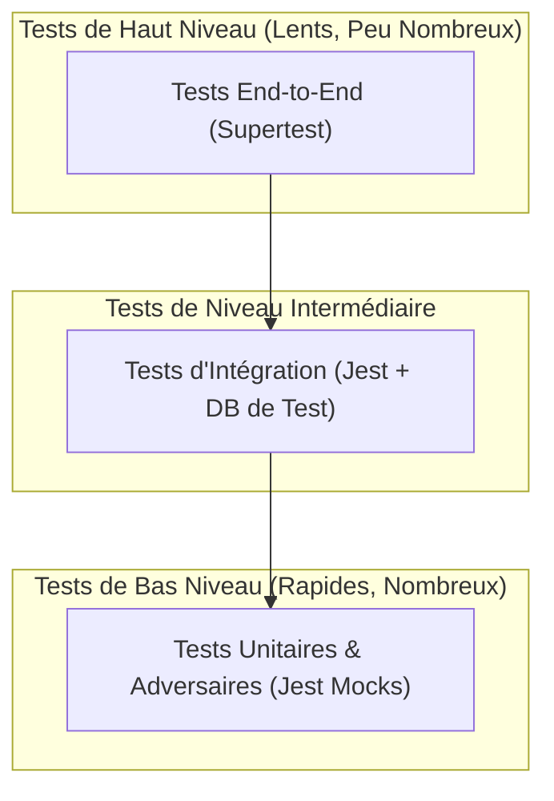

# [Documentation Technique] Module de Planification Avancée

**Public Cible :** Développeurs Backend (actuels et futurs)
**Version du Document :** 1.0

Ce document détaille l'architecture, la conception, et le fonctionnement interne du module de planification avancée. Il a pour but de fournir une compréhension complète du module pour faciliter sa maintenance et ses évolutions futures.

---

## 1. Introduction & Vision d'Ensemble

### 1.1. Problème Résolu

L'ancien système de planification manquait de flexibilité et ne permettait pas de gérer efficacement les exceptions et les plannings complexes. Ce module a été entièrement refondu pour offrir une solution robuste, centralisée et extensible pour la gestion des emplois du temps.

### 1.2. Objectif et Périmètre Fonctionnel

Le module de planification avancée fournit un ensemble complet de fonctionnalités pour :
*   **Créer et gérer des modèles de plannings récurrents** (`RecurringPlanningModel`) qui définissent des semaines ou des cycles de travail types.
*   **Gérer les pauses** de manière intégrée au sein de ces modèles.
*   **Affecter des membres** à ces plannings récurrents pour des périodes de temps définies (`RpmMemberAssignment`).
*   **Gérer les exceptions et ajustements journaliers** (maladie, formation, travail effectif, etc.) via des `DailyAdjustmentSlot` (DAS).
*   **Calculer dynamiquement l'emploi du temps effectif** d'un membre pour n'importe quel jour, en combinant intelligemment le planning récurrent et les ajustements journaliers.

---

## 2. Architecture Technique

### 2.1. Stack Technologique

Le module est construit sur une stack moderne, éprouvée et orientée vers la robustesse et la performance :
*   **Langage :** TypeScript 5+
*   **Environnement d'exécution :** Node.js v20+
*   **Framework Web :** Express.js
*   **Base de Données :** MySQL
*   **ORM :** Sequelize v6
*   **Validation des Données :** Zod
*   **Gestion des Récurrences :** RRule.js
*   **Gestion des Dates & Fuseaux Horaires :** date-fns & date-fns-tz
*   **Framework de Test :** Jest (avec Supertest pour les tests E2E)

### 2.2. Diagramme des Composants & Flux de Données

Le flux d'une requête suit un cheminement classique et découplé, garantissant une séparation claire des responsabilités :

```mermaid
graph TD
    A[Requête HTTP] --> B{Routeur Express};
    B --> C{Middlewares (Auth, Sécurité)};
    C --> D[Contrôleur];
    D --> E{Service Applicatif};
    E --> F[Modèle Sequelize];
    F <--> G((Base de Données));
    E --> H{Cache Service};
    H <--> I((Cache en Mémoire/Redis));
    E --> J[DTOs (Zod)];
    D -- Valide avec --> J;
    D -- Formate sortie --> J;
```

### 2.3. Structure des Dossiers

La structure du projet est organisée par fonctionnalité pour une meilleure modularité :

```
src/
├── controllers/    # Reçoit les requêtes HTTP, valide les entrées et appelle les services.
├── dtos/           # Définit les schémas de validation (Zod) pour les données d'entrée et de sortie.
├── errors/         # Contient les classes d'erreurs custom (ex: RpmNotFoundError).
├── middlewares/    # Gère l'authentification, l'autorisation et la gestion des erreurs.
├── models/         # Définit les modèles de données Sequelize et leurs relations.
├── routes/         # Définit les endpoints de l'API et les attache aux contrôleurs.
└── services/       # Contient toute la logique métier, les algorithmes et les interactions DB.
```

---

## 3. Modèles de Données (Schéma de la Base de Données)

### 3.1. Diagramme Entité-Relation (ERD)

Le diagramme suivant illustre les relations entre les entités principales du module.



### 3.2. Description Détaillée des Modèles

#### 3.2.1. `RecurringPlanningModel` (RPM)

Stocke les modèles de planning réutilisables (ex: "Semaine Matin", "Cycle 3x8").

| Attribut | Type | Rôle |
|---|---|---|
| `id` | INTEGER | Identifiant unique |
| `name` | STRING | Nom unique du modèle par établissement |
| `rruleString` | TEXT | Règle de récurrence (RFC 5545) définissant les jours d'application |
| `globalStartTime` | TIME | Heure de début de la journée de travail/indisponibilité |
| `globalEndTime` | TIME | Heure de fin de la journée de travail/indisponibilité |
| `defaultBlockType`| ENUM | `WORK` ou `UNAVAILABILITY` |
| `breaks` | JSONB | Tableau d'objets `RPMBreak` pour les pauses |
| `establishmentId`| INTEGER | Clé étrangère vers `Establishment` |

#### 3.2.2. `RecurringPlanningModelMemberAssignment` (RPMMA)

Lie un membre à un RPM pour une période donnée.

| Attribut | Type | Rôle |
|---|---|---|
| `id` | INTEGER | Identifiant unique |
| `membershipId` | INTEGER | Clé étrangère vers `Membership` |
| `recurringPlanningModelId`| INTEGER | Clé étrangère vers `RecurringPlanningModel` |
| `assignmentStartDate`| DATEONLY | Début de validité de l'affectation |
| `assignmentEndDate`| DATEONLY | Fin de validité (peut être `NULL` pour une durée indéfinie) |

#### 3.2.3. `DailyAdjustmentSlot` (DAS)

Représente une exception ou un événement spécifique pour le planning journalier d'un membre.

| Attribut | Type | Rôle |
|---|---|---|
| `id` | INTEGER | Identifiant unique |
| `membershipId` | INTEGER | Clé étrangère vers `Membership` |
| `slotDate` | DATEONLY | Jour concerné par l'ajustement |
| `startTime` | TIME | Heure de début du créneau |
| `endTime` | TIME | Heure de fin du créneau |
| `slotType` | ENUM | Nature de l'événement (`EFFECTIVE_WORK`, `SICK_LEAVE`, etc.) |
| `isManualOverride`| BOOLEAN | `true` si créé manuellement, prioritaire sur le RPM |

---

## 4. Services Applicatifs (Cœur de la Logique Métier)

### 4.1. `DailyScheduleService` (Service Critique)

*   **Responsabilité :** C'est le "cerveau" du module. Sa seule mission est de calculer l'emploi du temps final et précis d'un membre pour un jour donné. Il orchestre les autres entités en suivant un algorithme strict :
    1.  Trouver l'affectation RPM active pour le membre à la date cible.
    2.  Si elle existe, générer les blocs de travail de base du RPM.
    3.  Soustraire les pauses définies dans le RPM de ces blocs de travail.
    4.  Récupérer tous les DAS pour ce jour.
    5.  "Perforer" les blocs RPM avec les DAS, qui ont la priorité.
    6.  Retourner la liste finale des créneaux calculés.
*   **Tableau des Méthodes Publiques :**
    | Méthode | Description | Erreurs Possibles |
    |---|---|---|
    | `getDailyScheduleForMember` | Calcule et retourne le planning détaillé d'un membre pour une date donnée. | `MembershipNotFoundError`, `TimezoneConfigurationError` |

### 4.2. `RecurringPlanningModelService`

*   **Responsabilité :** Gère le cycle de vie (CRUD) des modèles de planning récurrents.
*   **Tableau des Méthodes Publiques :**
    | Méthode | Description | Erreurs Possibles |
    |---|---|---|
    | `createRpm` | Crée un nouveau RPM, valide son nom et la structure des pauses. | `RpmNameConflictError`, `RpmCreationError` |
    | `updateRpm` | Met à jour un RPM et invalide le cache des plannings des membres affectés. | `RpmNotFoundError`, `RpmNameConflictError` |
    | `deleteRpm` | Supprime un RPM. | `RpmNotFoundError` |
    | `getRpmById` / `listRpms...` | Récupère un ou plusieurs RPMs. | - |

### 4.3. `RpmMemberAssignmentService`

*   **Responsabilité :** Gère les affectations des membres aux RPMs, avec une validation stricte pour empêcher tout chevauchement de périodes pour un même membre.
*   **Tableau des Méthodes Publiques :**
    | Méthode | Description | Erreurs Possibles |
    |---|---|---|
    | `createAssignment` / `updateAssignment` | Crée/Met à jour une affectation en vérifiant les conflits. | `RpmAssignmentError` (overlap), `MembershipNotFoundError` |
    | `bulkAssignMembersToRpm` | Affecte un RPM à plusieurs membres en une seule transaction atomique par membre. | - (retourne un objet avec succès/erreurs) |
    | `deleteAssignment` | Supprime une affectation. | `RpmAssignmentNotFoundError` |

### 4.4. `DailyAdjustmentSlotService`

*   **Responsabilité :** Gère le CRUD des ajustements journaliers (DAS) et valide les conflits de créneaux pour un même membre à une même date.
*   **Tableau des Méthodes Publiques :**
    | Méthode | Description | Erreurs Possibles |
    |---|---|---|
    | `createDas` / `updateDas` | Crée/Met à jour un DAS en vérifiant les chevauchements. | `DasConflictError`, `DasUpdateError` (tâches invalides) |
    | `bulkUpdateDas` / `bulkDeleteDas` | Opérations en masse sur les DAS. | - |

---

## 5. API Endpoints & Contrats de Données

### 5.1. Tableau des Endpoints REST

Tous les endpoints sont préfixés par `/api/users/me/establishments/:establishmentId/planning`.

| Méthode | URL | Contrôleur | Rôle Requis | Description |
|---|---|---|---|---|
| `POST`| `/recurring-planning-models` | `RPMController.create` | ADMIN | Crée un nouveau modèle de planning. |
| `GET` | `/memberships/:membershipId/daily-schedule` | `DailyScheduleController.getMemberSchedule`| ADMIN ou Soi-même | Récupère le planning calculé d'un membre. |
| ... | ... | ... | ... | ... |

### 5.2. Philosophie des DTOs et Validation avec Zod

Nous utilisons la bibliothèque **Zod** pour toutes les validations de données d'entrée. Cette approche garantit :
*   **Robustesse :** Aucune donnée invalide ne peut entrer dans nos services.
*   **Source Unique de Vérité :** Le schéma Zod définit à la fois les règles de validation et le type TypeScript, évitant toute désynchronisation.
*   **Clarté des Erreurs :** En cas de données invalides, les erreurs de Zod sont claires et précises, et sont retournées au client pour l'aider à corriger sa requête.

### 5.3. Gestion des Erreurs et Codes de Statut

Le système repose sur deux piliers :
1.  **Erreurs Custom :** Nous utilisons une hiérarchie d'erreurs personnalisées (`RpmNotFoundError` hérite de `PlanningModuleError`, qui hérite de `AppError`) pour donner un sens métier à chaque erreur.
2.  **Middleware Global :** Un `globalErrorHandler` est enregistré à la fin de notre application Express. Il intercepte toutes les erreurs, les inspecte (`instanceof ZodError`, `instanceof AppError`), et formate une réponse HTTP JSON propre avec le code de statut approprié (400, 403, 404, 409, 500).

---

## 6. Stratégie de Test & Assurance Qualité

### 6.1. Philosophie : La Pyramide de Test

Notre stratégie d'assurance qualité repose sur la pyramide de test classique pour garantir une couverture à la fois large et profonde.



*   **Tests Unitaires :** Valident la logique de chaque fonction/service en isolation totale. Rapides et précis.
*   **Tests d'Intégration :** Valident la collaboration entre nos services et la base de données réelle.
*   **Tests End-to-End :** Valident le système complet, de la requête HTTP à la réponse, en incluant les middlewares et les contrôleurs.

---

## 7. Guide Pratique du Développeur

### 7.1. Prérequis d'Installation

*   Node.js (v20+)
*   npm (v9+)
*   Docker (recommandé pour la base de données MySQL)

### 7.2. Configuration de l'Environnement

Créez un fichier `.env` à la racine du projet en vous basant sur `.env.example`. Les variables clés sont :
*   `DATABASE_URL_TEST`: Chaîne de connexion à la base de données de test.
*   `JWT_SECRET`: Clé secrète pour la signature des tokens.
*   ...

### 7.3. Commandes `npm` Essentielles

| Commande | Description |
|---|---|
| `npm run dev` | Lance le serveur de développement avec `nodemon`. |
| `npm run build` | Compile le code TypeScript en JavaScript dans le dossier `/dist`. |
| `npm test` | Exécute l'intégralité de la suite de tests (tous les types). |
| `npm run test:unit` | Exécute uniquement les tests unitaires. |
| `npm run lint` | Analyse le code avec ESLint pour détecter les problèmes de style et de qualité. |
| `npm run migrate:test`| Applique les migrations sur la base de données de test. |

### 7.4. Processus Recommandé pour Contribuer

1.  **Créer une Branche :** `git checkout -b feature/ma-nouvelle-fonctionnalite`
2.  **Écrire un Test Qui Échoue :** Ajoutez un test (unitaire, intégration ou E2E) qui décrit la nouvelle fonctionnalité ou le bug à corriger. Vérifiez qu'il échoue.
3.  **Implémenter le Code :** Écrivez le code de production nécessaire pour faire passer le test.
4.  **Lancer les Tests :** Assurez-vous que tous les tests de la suite passent.
5.  **Mettre à Jour la Documentation :** Si vous avez ajouté un endpoint, un modèle ou une logique complexe, mettez à jour ce document.
6.  **Ouvrir une Pull Request.**

---

## 8. Annexe : Décisions d'Architecture Clés

### 8.1. Gestion des Fuseaux Horaires

La gestion des fuseaux horaires est critique. Tous les calculs de récurrence sont effectués en utilisant la bibliothèque `rrule.js`. Pour garantir la fiabilité, nous passons systématiquement le `tzid` (ex: 'Europe/Paris') de l'établissement à l'instance de la `RRule`. Cela assure que les occurrences journalières sont calculées dans le fuseau horaire local de l'établissement, évitant les erreurs "off-by-one-day".

### 8.2. Stratégie de Cache

Une stratégie de cache "cache-aside" est utilisée pour optimiser les performances, notamment pour les lectures de planning. Le `DailyScheduleService` vérifie d'abord si le planning d'un jour est en cache. Si oui, il le retourne. Sinon, il le calcule, le stocke dans le cache avec un TTL (Time-To-Live), puis le retourne. Les opérations d'écriture (`create`, `update`, `delete`) sur les entités de planning (`RPM`, `RPMMA`, `DAS`) sont responsables de l'**invalidation proactive** des clés de cache pertinentes pour garantir la fraîcheur des données.

### 8.3. Gestion des Transactions Atomiques

Toutes les opérations d'écriture qui modifient plusieurs enregistrements ou qui nécessitent une validation complexe (ex: `bulkAssignMembersToRpm`, `createAssignment`) sont encapsulées dans une transaction Sequelize. Si une partie de l'opération échoue (ex: un membre sur trois a un conflit d'affectation), la transaction pour cet élément est annulée (`rollback`), garantissant qu'aucune donnée partielle ou incohérente n'est persistée.